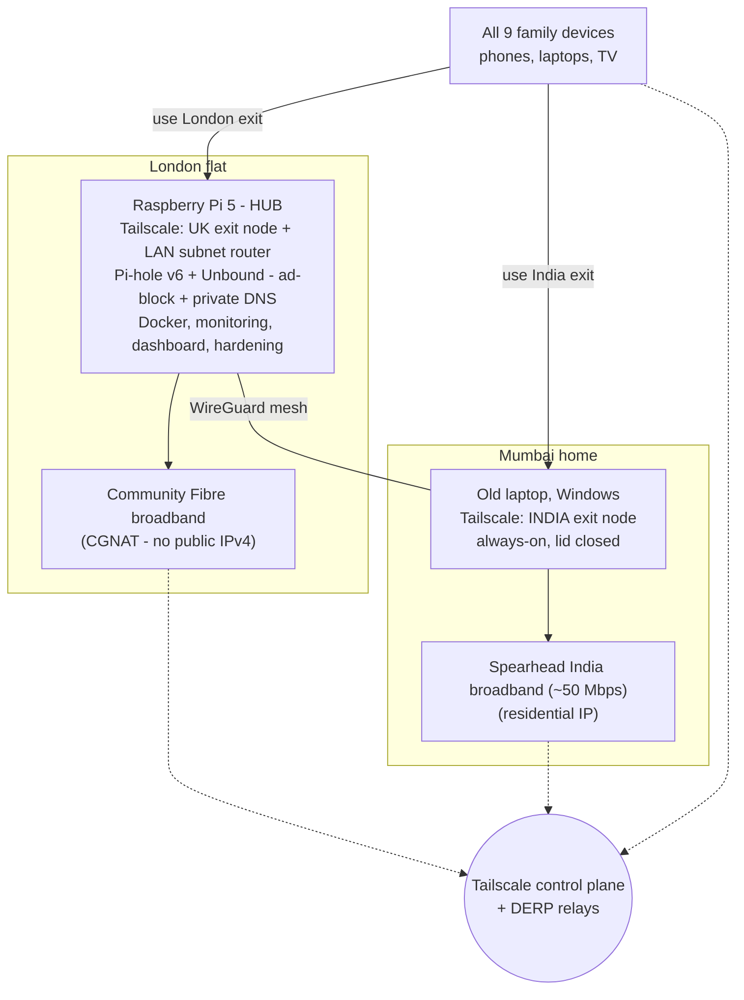
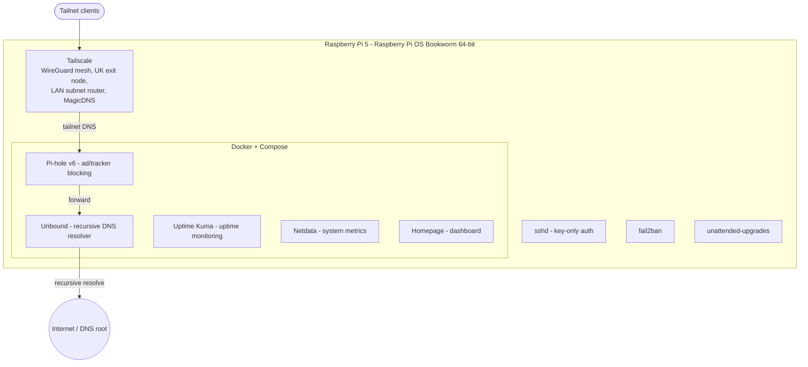
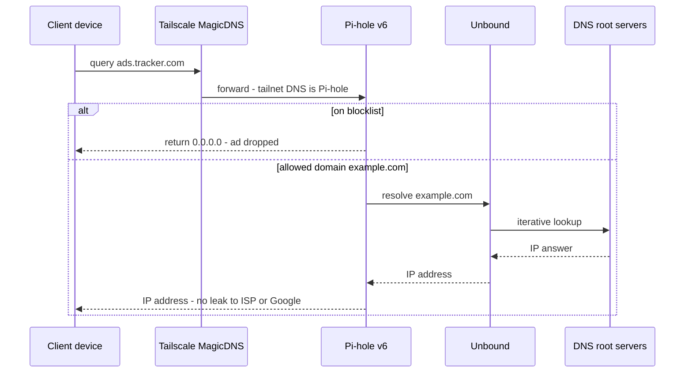
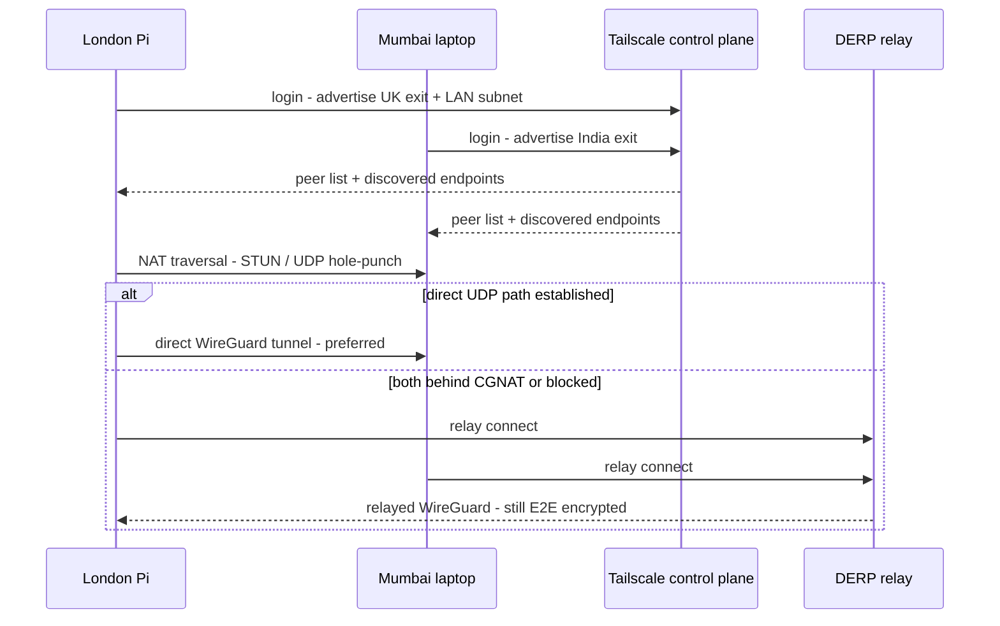
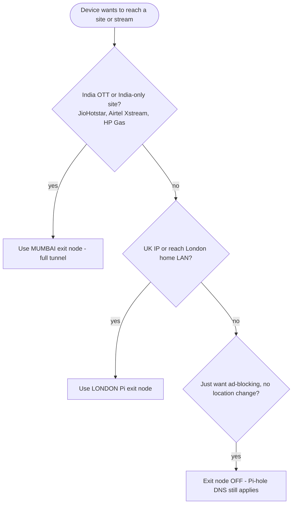
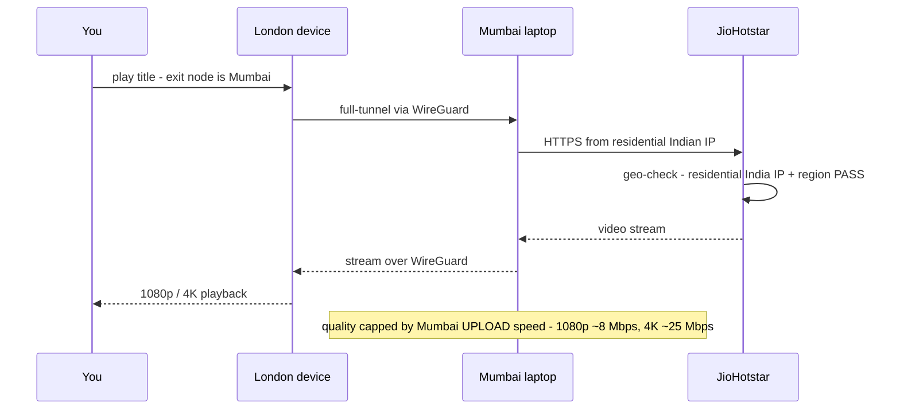
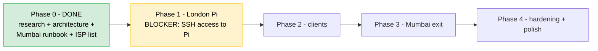

# London + Mumbai Self-Hosted VPN (Pi 5)

Status: BUILDING (decisions locked)
Owner: Vincent Pereira
Hardware: Raspberry Pi 5 (London flat) + an old always-on laptop (Mumbai home)

------------------------------------------------------------------------------
## 1. Goals
------------------------------------------------------------------------------
1. Remote access to the London home network from anywhere + a UK/London IP when travelling.
2. Watch Indian OTT from London (JioHotstar, Airtel Xstream) and use India-only
   sites (HP Gas, Adani Electricity) already paid for in Mumbai.
3. Network-wide ad/tracker blocking + DNS privacy.
4. ISP-traffic anonymisation (secondary; partial only - see caveat section 8).
5. Free / near-zero ongoing cost. Prefer GBP 0.

Devices: 4 mobiles (Android + iOS), 3 Windows laptops, 1 TV, 1 Pi 5.
Users: 4 simultaneous (family).

------------------------------------------------------------------------------
## 2. Decided architecture: two-node Tailscale mesh + Pi-hole/Unbound
------------------------------------------------------------------------------
Two research findings locked the design:

A) Community Fibre (London) uses CGNAT by default (public IP is a GBP 4/mo add-on
   we do NOT need). Classic port-forward WireGuard cannot work here.
   -> Use Tailscale (free WireGuard mesh), which punches through CGNAT. No public
      IP or port forwarding required.

B) Indian OTT blocks all datacenter/VPS/commercial-VPN IPs. Only a RESIDENTIAL
   Indian IP works reliably. A cheap India VPS will NOT unblock OTT.
   -> Put the India exit node on the Mumbai home's own broadband (residential IP).

Architecture:

_Figure 1 - System topology (two-site Tailscale mesh). Each device picks an exit
node: India OTT / India sites -> Mumbai; UK IP / London LAN -> London (Pi);
ad-blocking only -> no exit node (Pi-hole DNS still applies). Detailed views in
section 9._

Cost: GBP 0/month. Tailscale free Personal = 6 users + unlimited devices (fits
4 users / 9 devices). All other software is FOSS.

------------------------------------------------------------------------------
## 3. Component stack (all free / open source)
------------------------------------------------------------------------------
London Pi 5 (Raspberry Pi OS Bookworm 64-bit - to confirm):
- Tailscale (mesh, exit node, subnet router, MagicDNS)
- Pi-hole v6 (ad/tracker blocking) + Unbound (recursive DNS)
- Docker + Compose (to run Pi-hole/Unbound/monitoring cleanly)
- Monitoring: Uptime Kuma + Netdata (optional, "maximum features")
- Homepage dashboard (optional)
- Hardening: SSH key-only, fail2ban, unattended-upgrades

Visual: see Figure 2 (section 9) for the full service-stack diagram.

Mumbai old laptop (Windows):
- Tailscale only, advertised as exit node. See docs/MUMBAI-SETUP.md.

Clients: Tailscale apps on iOS, Android, Windows, TV.

------------------------------------------------------------------------------
## 4. Decisions locked (from user)
------------------------------------------------------------------------------
- Mumbai node = the old laptop, kept always-on. GBP 0. (docs/MUMBAI-SETUP.md)
- Mumbai ISP = Spearhead India (~50 Mbps, upload upgradable on request).
  What to request: see docs/ISP-PARTNER-REQUEST.md (mainly upload speed +
  confirm residential/non-datacenter IP + unlimited data).
- Mesh = Tailscale free (chosen; sidesteps CGNAT on both ends, free, fits users).
- London deployment = I drive the Pi over SSH from the London PC (same flat).
- DNS = Pi-hole + Unbound (ad-blocking + privacy), pushed to all clients.

------------------------------------------------------------------------------
## 5. Cost summary
------------------------------------------------------------------------------
| Item                              | Cost            | Notes                              |
|-----------------------------------|-----------------|------------------------------------|
| Tailscale (mesh)                  | GBP 0/mo        | Free Personal: 6 users, unlimited  |
| WireGuard / Pi-hole / Unbound     | GBP 0           | FOSS                               |
| London Pi 5                       | GBP 0           | Already owned                      |
| Mumbai node (old laptop)          | GBP 0           | Repurposed                         |
| Community Fibre public IP         | NOT needed      | Skip the GBP 4/mo add-on           |
| True anonymity (no-log VPN)       | OPTIONAL        | Only if Goal 4 matters; ~GBP 3-5/m |

Running cost: GBP 0/month. Optional anonymity layer is the only possible spend.

------------------------------------------------------------------------------
## 6. Deployment approach
------------------------------------------------------------------------------
- London: I SSH into the Pi from the London PC (same flat), build the stack,
  switch to SSH-key auth, then also reach it via its Tailscale IP from anywhere.
- Mumbai: the helper follows docs/MUMBAI-SETUP.md; I verify the egress IP and
  enable the exit node from the Tailscale admin console.
- Clients: install Tailscale per docs/CLIENT-SETUP.md (to be written), pick exit.

------------------------------------------------------------------------------
## 7. Build phases (checklist)
------------------------------------------------------------------------------
Visual summary: see Figure 7 in section 9.

Phase 0 - Planning & decisions [DONE]
  [x] Research architecture
  [x] Identify CGNAT + OTT constraints
  [x] Confirm Mumbai node (old laptop), ISP (Spearhead), helper, PC location
  [x] Write Mumbai runbook + ISP request list
  [ ] Get SSH access to London Pi + confirm OS (awaiting user)

Phase 1 - London Pi foundation
  [ ] OS update / hardening / SSH key-only auth
  [ ] Install Docker + Compose
  [ ] Install Tailscale, join tailnet, advertise UK exit node + LAN subnet router
  [ ] Deploy Pi-hole v6 + Unbound (Compose)
  [ ] Point tailnet DNS at Pi-hole (ad-block for all clients)
  [ ] Monitoring (Uptime Kuma / Netdata) + Homepage dashboard (optional)

Phase 2 - Clients
  [ ] Install Tailscale on 4 phones, 3 laptops, TV
  [ ] Configure exit-node switching per use case
  [ ] Verify UK exit + LAN access + ad-blocking

Phase 3 - Mumbai India exit node
  [ ] Helper runs docs/MUMBAI-SETUP.md (laptop on, Tailscale, advertise exit)
  [ ] Verify egress IP is residential Indian (not datacenter)
  [ ] Test JioHotstar / Airtel Xstream / HP Gas / Adani Electricity from London
  [ ] (If IP flagged datacenter) request residential IP from Spearhead partner

Phase 4 - Hardening & polish
  [ ] fail2ban, unattended-upgrades, backups, UPS consideration
  [ ] Family runbook (how to switch exit nodes; what to do if it stops)

------------------------------------------------------------------------------
## 8. Caveats (expectations)
------------------------------------------------------------------------------
- Anonymity: routing through your own Mumbai node hides London traffic from
  Community Fibre but exposes it to the Mumbai ISP (and vice versa). Self-hosting
  is NOT the same as a no-log commercial VPN. Optional layer if needed (~GBP 3-5/m).
- OTT account: JioHotstar still needs an Indian mobile number for OTP. User has
  Mumbai subscriptions, so fine.
- OTT quality: capped by Mumbai UPLOAD speed (1080p ~8 Mbps up, 4K ~25 Mbps up).
- OTT routing: while watching, the device must use the Mumbai exit node as a FULL
  tunnel (not DNS-only), because Jio checks IP + region on the stream itself.
- VPN/OTT use may conflict with OTT terms of service; this is the user's own
  paid subscriptions on their own residential IP.

------------------------------------------------------------------------------
## 9. Architecture & workflow diagrams (Mermaid)
------------------------------------------------------------------------------
These diagrams render on GitHub. Figure 1 (system topology) is inline in
section 2; the views below expand it - component stack, DNS chain, mesh
formation, routing decision, OTT streaming path, and the build roadmap.

### Figure 2 - London Pi component & service stack

### Figure 3 - DNS resolution + ad-blocking chain

### Figure 4 - CGNAT traversal / mesh formation

### Figure 5 - Traffic routing decision (which exit node)

### Figure 6 - OTT streaming path (London watches via Mumbai)

### Figure 7 - Build phase roadmap

