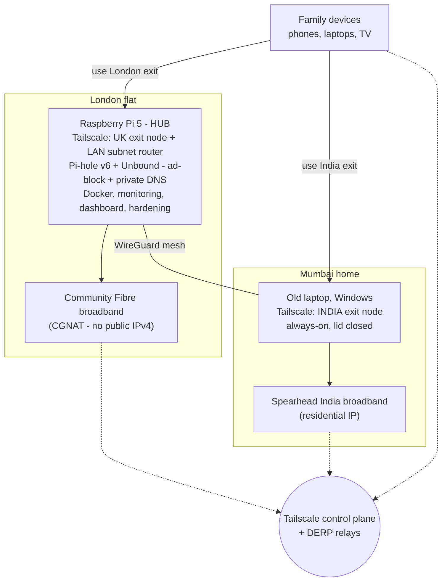
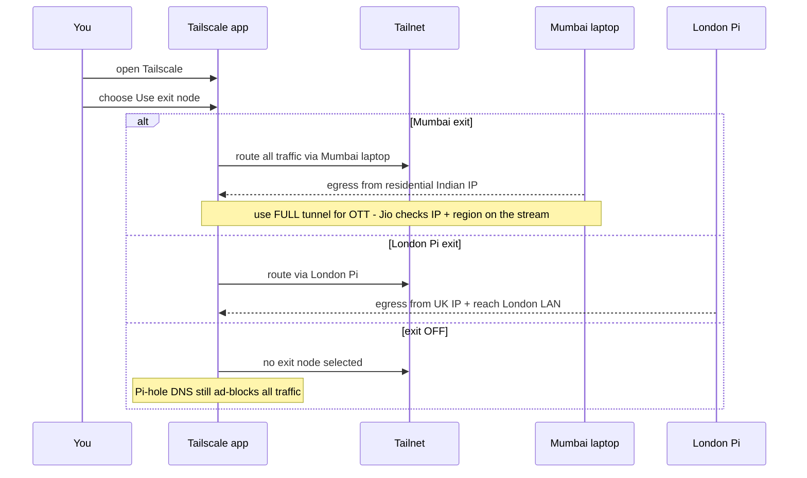
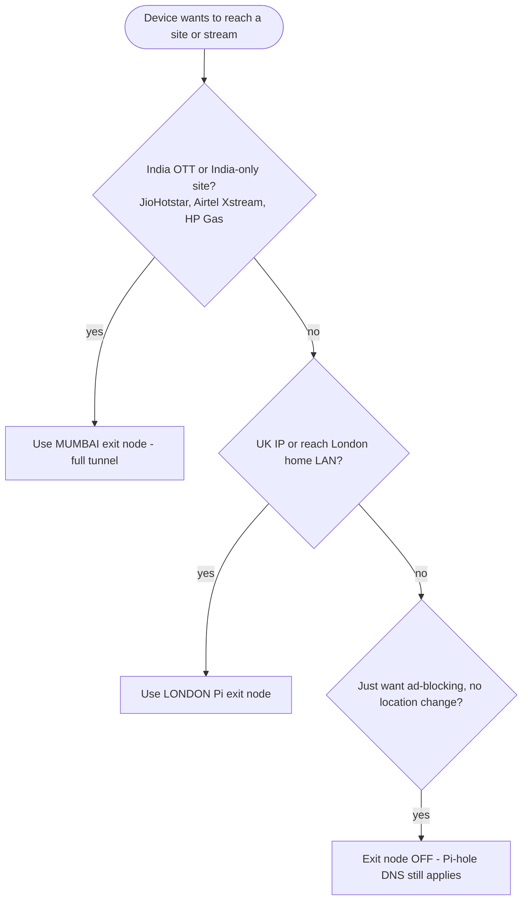

# RNR-VPN

A self-hosted, near-zero-cost personal VPN that spans a London flat and a
Mumbai home. It runs on a Raspberry Pi 5 (London) and an always-on laptop
(Mumbai), and gives the whole family:

- a **UK exit point** (reach the London home network from anywhere; UK IP abroad);
- an **India exit point** (watch Indian OTT and use India-only sites from London);
- **network-wide ad / tracker blocking** and private recursive DNS;
- all on **free, open-source software** with **GBP 0 / month** running cost.

Owner: Vincent S. Pereira
Status: Building - planning complete, deployment in progress.

---

## Table of contents
1. What it is
2. Problems it solves
3. How it works (architecture)
4. The two findings that shaped the design
5. Component stack
6. Cost
7. Repository contents
8. Prerequisites
9. Build roadmap
10. Everyday usage (switching exit nodes)
11. Security notes
12. Troubleshooting
13. Caveats and disclaimer
14. References

---

## 1. What it is

RNR-VPN is a two-site personal VPN mesh. A Raspberry Pi 5 in the London flat is
the hub: it runs the mesh, blocks ads, resolves DNS privately, and advertises a
UK "exit node". A second always-on device (an old laptop) at the Mumbai home
advertises an India "exit node" on a residential Indian IP. Every family device
(phone, laptop, TV) joins the same mesh and chooses which exit node to use, on
demand.

Because both sides join a Tailscale (WireGuard) mesh, no public IP and no port
forwarding are required - the mesh works through Consumer-Grade NAT (CGNAT),
which both broadband lines use.

---

## 2. Problems it solves

| Goal | How RNR-VPN solves it |
|---|---|
| Reach the London home network from anywhere + a UK IP when travelling | London Pi is a UK exit node and LAN subnet router. |
| Watch Indian OTT (JioHotstar, Airtel Xstream) and use India-only sites (HP Gas, Adani Electricity) from London | Mumbai laptop is an India exit node on a residential IP. |
| Block ads/trackers across all devices + keep DNS private | Pi-hole v6 + Unbound on the Pi, pushed to every device via the mesh. |
| Keep it cheap | Everything is FOSS; Tailscale's free tier covers 6 users / unlimited devices. |

---

## 3. How it works (architecture)



_Figure 1 - System topology: a two-site Tailscale mesh. Both sites sit behind NAT
(Community Fibre CGNAT in London, Spearhead in Mumbai); Tailscale coordinates the
mesh and relays traffic if no direct UDP path can be punched through. Every family
device joins the mesh and picks an exit node on demand (see section 10)._

---

## 4. The two findings that shaped the design

### Finding A - Community Fibre (London) uses CGNAT
Community Fibre puts customers behind Carrier-Grade NAT by default; a public
IPv4 is a paid add-on. The classic "self-hosted WireGuard + port-forward a
port" approach cannot work - the Pi is not reachable from the internet.
**Resolution:** use Tailscale, a WireGuard mesh that punches through CGNAT with
no public IP and no port forwarding. Free. The GBP 4/month public-IP add-on is
**not** needed.

### Finding B - Indian OTT blocks all datacenter / VPS / commercial-VPN IPs
JioHotstar and JioCinema detect and block cloud-provider IP ranges and known
commercial-VPN endpoints; they also flag geographic "teleportation" jumps. The
only reliable bypass is a **residential Indian IP**. A cheap India VPS will not
work.
**Resolution:** put the India exit node on the Mumbai home's own broadband so
its traffic egresses from a real residential Indian IP.

---

## 5. Component stack

All components are free / open source.

London Pi 5 (Raspberry Pi OS Bookworm, 64-bit):
- **Tailscale** - WireGuard mesh, UK exit node, LAN subnet router, MagicDNS.
- **Pi-hole v6** - network-wide ad / tracker blocking.
- **Unbound** - recursive DNS resolver (no leaks to Google / the ISP).
- **Docker + Compose** - clean, reproducible deployment of the above.
- **Monitoring** - Uptime Kuma + Netdata (optional).
- **Homepage** - dashboard (optional).
- **Hardening** - SSH key-only auth, fail2ban, unattended-upgrades.

Mumbai laptop (Windows):
- **Tailscale** only, advertised as the India exit node.

Clients:
- **Tailscale** apps on iOS, Android, Windows, and the TV.

---

## 6. Cost

| Item | Cost | Notes |
|---|---|---|
| Tailscale (mesh) | GBP 0 / month | Free Personal: 6 users, unlimited devices. |
| WireGuard / Pi-hole / Unbound | GBP 0 | FOSS. |
| London Pi 5 | GBP 0 | Already owned. |
| Mumbai node (old laptop) | GBP 0 | Repurposed. |
| Community Fibre public IP | not needed | Mesh sidesteps CGNAT; skip the add-on. |
| True anonymity (no-log VPN) | optional | Only if ISP-blind anonymity is required; ~GBP 3-5/month. |

**Running cost: GBP 0 / month.** The only optional spend is a no-log VPN layer
if true anonymity matters (self-hosting alone does not provide it - see
Caveats).

---

## 7. Repository contents

```
RNR-VPN/
  README.md                    This file.
  ARCHITECTURE.md              Full design, decisions, build-phase checklist.
  .gitignore                   Keeps secrets / local files out of git.
  docs/
    MUMBAI-SETUP.md            Plain-language setup guide for the Mumbai helper.
    ISP-PARTNER-REQUEST.md     Exactly what to ask the Mumbai ISP partner for.
```

More files (compose files, install scripts, client-setup guide) will be added
as the build progresses.

---

## 8. Prerequisites

London:
- Raspberry Pi 5 with power supply and storage (microSD or USB SSD).
- Raspberry Pi OS Bookworm (64-bit) installed, SSH enabled.
- A Windows PC on the same network to drive the Pi.

Mumbai:
- An always-on laptop (Windows) with its charger.
- The Spearhead broadband connection; ideally >= 25-50 Mbps **upload** and
  unlimited data; IP confirmed as residential (not datacenter). See
  `docs/ISP-PARTNER-REQUEST.md`.
- Someone in Mumbai to follow `docs/MUMBAI-SETUP.md`.

Accounts / identifiers:
- A Tailscale account (free) - created during the London build.
- Optional: a DuckDNS name (free) if HTTPS names are wanted later.

---

## 9. Build roadmap

- [x] Phase 0 - Research and lock the architecture.
- [x] Phase 0 - Write the Mumbai runbook and the ISP request list.
- [ ] Phase 1 - London Pi: Docker, Tailscale (UK exit + LAN subnet router),
      Pi-hole v6 + Unbound, mesh DNS, monitoring.
- [ ] Phase 2 - Clients: install Tailscale on the phones / laptops / TV;
      verify UK exit, LAN access, ad-blocking.
- [ ] Phase 3 - Mumbai India exit node: bring the laptop online, verify the
      egress IP is residential Indian, test JioHotstar / Airtel Xstream /
      HP Gas / Adani Electricity from London.
- [ ] Phase 4 - Hardening and polish: fail2ban, unattended-upgrades, backups,
      UPS consideration, a family runbook.

Current blocker: SSH access to the London Pi (IP, username, password, OS
version) to start Phase 1.

---

## 10. Everyday usage (switching exit nodes)

Once a device has the Tailscale app and is signed in, switching is one tap in
the app:

- To watch Indian OTT or open an India-only site: open Tailscale -> **Use exit
  node** -> pick the **Mumbai** node. (Use the full-tunnel option while
  streaming, because Jio checks IP + region on the stream itself.)
- To use a UK IP or reach the London home: pick the **London (Pi)** exit node.
- For normal browsing with ad-blocking but no location change: turn the exit
  node **off**. Pi-hole ad-blocking still applies to all traffic on the mesh.

How a switch looks in practice:



Which exit node to pick for a given task:



---

## 11. Security notes

- The London Pi will be switched to **SSH key-only** authentication after the
  first login; the initial password is only used to bootstrap key access.
- fail2ban and unattended security upgrades are part of the Pi hardening.
- Tailscale is WireGuard-based and end-to-end encrypted; traffic between nodes
  is encrypted even when traversing relays.
- **No secrets are committed to this repository.** The `.gitignore` excludes
  `.env`, key files, and secret directories. The Mumbai runbook uses a
  placeholder (`PASTE-CODE-HERE`) for the one-time auth key.

---

## 12. Troubleshooting

- "Indian site still blocked from London" - confirm the device is using the
  **Mumbai** exit node and check the egress IP shows as a residential Indian
  ISP. If it shows as a datacenter/hosting range, the Mumbai IP needs to be
  moved to a residential range (ask the ISP partner).
- "Streaming buffers / low quality" - limited by Mumbai's **upload** speed.
  1080p needs ~8 Mbps up; 4K needs ~25 Mbps up. Ask the ISP partner to raise it.
- "Mumbai laptop disconnected" - re-run the one-line Tailscale command in
  `docs/MUMBAI-SETUP.md` (Step 3) with a fresh auth key.
- "Can't reach the Pi" - check the Pi is on, SSH is enabled, and the driving PC
  is on the same network; once Tailscale is up, manage the Pi via its Tailscale
  IP from anywhere.

---

## 13. Caveats and disclaimer

- **Anonymity:** routing through your own Mumbai node hides London traffic from
  Community Fibre but exposes it to the Mumbai ISP (and vice versa).
  Self-hosting is not the same as a no-log commercial VPN. If true ISP-blind
  anonymity matters, add a cheap no-log VPN (e.g. Mullvad) as an extra exit.
- **OTT accounts:** JioHotstar still requires an Indian mobile number for OTP
  login; this is already covered by the existing Mumbai subscriptions.
- **Terms of service:** using a VPN to bypass geo-restrictions may conflict
  with the OTT providers' terms. RNR-VPN only routes the owner's own paid
  subscriptions through the owner's own residential IP; the user is responsible
  for compliance in their jurisdiction.

---

## 14. References

- Tailscale - https://tailscale.com/ (free WireGuard mesh; CGNAT traversal).
- WireGuard - https://www.wireguard.com/ (the underlying protocol).
- Pi-hole - https://pi-hole.net/ (network-wide ad blocking).
- Unbound - https://nlnetlabs.nl/projects/unbound/about/ (recursive DNS).
- PiVPN - https://www.pivpn.io/ (reference installer for WireGuard on a Pi).
- Community Fibre IP / port-forwarding help - https://help.communityfibre.co.uk/
