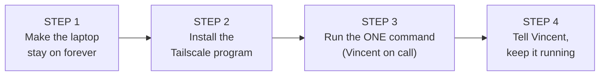

# Mumbai Setup Guide - India "doorway" (exit node)

For: the helper in Mumbai. Written in plain, non-technical language.
Laptop: the old laptop Vincent will keep running. (This guide assumes Windows.
If the laptop does NOT have Windows, stop and tell Vincent - he will send different steps.)

Vincent will read this too and be on a phone call with you for the short parts
marked [VINCENT ON CALL].

------------------------------------------------------------------------------
WHAT WE ARE DOING (in plain words)
------------------------------------------------------------------------------
We turn the old laptop into a "doorway". When Vincent is in London, he connects
to the internet THROUGH this Mumbai laptop. To Indian websites (JioHotstar, HP
Gas, Adani Electricity) it will look like he is in Mumbai, so they let him in.

The laptop must:
  - stay switched ON and plugged into power, all the time;
  - stay connected to the Mumbai internet;
  - run a small free program called Tailscale.

Once set up it mostly looks after itself.

The 4 steps at a glance:

------------------------------------------------------------------------------
BEFORE YOU START
------------------------------------------------------------------------------
1. The old laptop + its charger, plugged into a power socket.
2. Internet working at the Mumbai home. BEST: connect the laptop with a LAN
   cable (more stable). If no cable, Wi-Fi is fine.
3. The laptop's Windows login password (you need it to install a program).
4. Be on a phone call with Vincent for the 2 short steps marked below.

------------------------------------------------------------------------------
STEP 1: Make the laptop stay on forever (stop it sleeping)
------------------------------------------------------------------------------
1. Switch on the laptop, log in.
2. Click Start (Windows logo, bottom-left) > Settings (gear icon) > System >
   Power & battery.
3. Under "Screen and sleep":
   - Set "Turn off my screen" to Never (for On battery AND Plugged in).
   - Set "Make my device sleep" to Never (for On battery AND Plugged in).
4. Close the window.
5. Stop it switching off when the lid closes:
   - Press the Windows key, type "Control Panel", press Enter.
   - Go to "Hardware and Sound" > "Power Options".
   - On the left, click "Choose what closing the lid does".
   - Next to "When I close the lid", choose "Do nothing" for BOTH "On battery"
     and "Plugged in". Click "Save changes".

Now the lid can be closed and the laptop keeps running.

------------------------------------------------------------------------------
STEP 2: Install the Tailscale program
------------------------------------------------------------------------------
1. Open a web browser (Chrome or Edge).
2. Go to: https://tailscale.com/download/windows
3. Click Download, then open/run the file that downloads.
   Say Yes / Allow to any permission boxes.
4. When finished, a small Tailscale icon appears near the clock, bottom-right
   (it may be hidden under the little up-arrow "^"). You do NOT need to click
   "Log in" - Vincent will give you a one-line command instead (next step).

------------------------------------------------------------------------------
STEP 3: Turn on the doorway with ONE command   [VINCENT ON CALL]
------------------------------------------------------------------------------
Vincent will send you a CODE (a long text string). Then:

1. Click Start, type "PowerShell".
2. RIGHT-click "Windows PowerShell", choose "Run as administrator".
   Click Yes.
3. A blue window opens. Copy this whole line, but REPLACE the word
   PASTE-CODE-HERE with the code Vincent gave you, then press Enter:

       tailscale up --authkey=PASTE-CODE-HERE --advertise-exit-node --accept-routes

   (To paste in the blue window: right-click once.)
4. Wait a few seconds. You should see "Success" or it returns to a prompt
   with no red error. That means it worked.

------------------------------------------------------------------------------
STEP 4: Tell Vincent, then keep it running
------------------------------------------------------------------------------
Tell Vincent: "Mumbai laptop is connected." Vincent checks from London that
Indian websites see it as being in India. If something needs changing, he tells you.

KEEP IT RUNNING:
  - Leave the laptop switched ON and plugged in 24/7.
  - Lid can stay closed (we set "Do nothing").
  - If Windows updates and restarts, that is OK. After it restarts, check the
    Tailscale icon near the clock shows "Connected". If it says "Disconnected",
    Vincent will resend the code and you redo Step 3.
  - If the internet blinks off and on, Tailscale reconnects by itself.

------------------------------------------------------------------------------
IF SOMETHING GOES WRONG
------------------------------------------------------------------------------
- "Tailscale shows Disconnected" -> Vincent resends the code, redo Step 3.
- "Vincent still can't open Indian sites" -> Vincent checks from his side; he
  may ask you to confirm the laptop is on and connected to the internet.
- Laptop very slow / hot -> make sure it is on a hard surface (not a bed/cushion)
  so air can flow, and the fan is not blocked.

Anything else: call/message Vincent.
